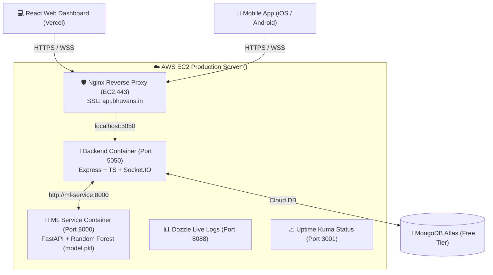

# Hosting & Deployment Guide

This guide covers how to run the **Behavior Prediction** platform locally, how it is currently hosted in production on **AWS EC2** + **Vercel**, and how to manage the automated **CI/CD pipeline** and **monitoring dashboards**.

---

## 1. Production Architecture (AWS EC2 + Vercel)

The application is deployed across a cloud-hosted 3-tier architecture:



### Infrastructure Details
- **Server**: AWS EC2 `t3.small` (2 vCPUs, 2 GB RAM, 8 GB EBS SSD) in `ap-south-1` (Mumbai).
- **Domain & SSL**: Hosted at **`https://api.bhuvans.in`** with automated Let's Encrypt SSL/TLS certificates and full WebSocket upgrade support (`wss://api.bhuvans.in/ws`).
- **Persistence for ML Feedback**: By hosting `ml-service` on EC2 with persistent disk storage, feedback data (`feedback_data.csv`) and hot-swapped retraining models (`model.pkl`) are permanently preserved across reboots.

---

## 2. Real-Time Monitoring & Log Dashboards

We run two lightweight, self-hosted web monitoring dashboards alongside the application containers:

1. **Dozzle (Live Log Streaming)** — **`http://<YOUR_EC2_IP>:8088`**
   - Stream, search, and filter real-time container logs for `backend` and `ml-service` in a dark-mode browser UI without needing SSH.
2. **Uptime Kuma (Status & Latency Page)** — **`http://<YOUR_EC2_IP>:3001`**
   - Active synthetic monitoring that pings `https://api.bhuvans.in` every 60 seconds, graphs API latency, and tracks SSL certificate renewal dates.

---

## 3. Automated CI/CD Pipeline (GitHub Actions)

A GitHub Actions workflow is configured at `[.github/workflows/deploy.yml](file:///Users/bhuvansshetty/projects/major/Behavior-Prediction/.github/workflows/deploy.yml)`. Every commit pushed to `main` automatically deploys to the AWS EC2 instance.

### Workflow Steps
1. **SCP Transfer**: Connects to the EC2 server over SSH and syncs project code to `/home/ubuntu/app` (excluding `node_modules`, `.git`, and `Frontend`).
2. **Environment Sync**: Writes the `ENV_FILE` secret into `/home/ubuntu/app/.env` on the server.
3. **Hot-Reload Containers**: Runs `sudo docker compose up -d --build --remove-orphans` to rebuild only modified layers and swap containers with zero downtime.

### Required GitHub Repository Secrets
Add these under **Settings** → **Secrets and variables** → **Actions**:
- `EC2_HOST`: `<YOUR_EC2_IP>`
- `EC2_USER`: `ubuntu`
- `EC2_SSH_KEY`: The complete private RSA key (`~/.ssh/behavior-prediction-key.pem`)
- `ENV_FILE`: *(Optional)* Production `.env` file contents for automated environment variable injection.

---

## 4. Frontend Deployment (Vercel)

The React/Vite web application is configured for seamless deployment to **Vercel**:

- **Production Configuration (`Frontend/.env.production`)**:
  ```ini
  VITE_API_URL=https://api.bhuvans.in
  VITE_WS_URL=wss://api.bhuvans.in/ws
  ```
  Vite automatically bundles these endpoints during `npm run build`, pointing production builds directly to the AWS EC2 backend.
- **SPA Routing (`Frontend/vercel.json`)**:
  Includes rewrite rules routing all paths `/(.*)` to `/index.html` to prevent 404 errors on browser refresh.

---

## 5. Mobile App Configuration (iOS / Android)

To connect a mobile application (React Native, Flutter, Kotlin, or Swift) to the live backend:

1. **Base API URL**: Set your HTTP client base URL to **`https://api.bhuvans.in`**.
2. **WebSocket Gateway**: Connect your socket client to **`wss://api.bhuvans.in/ws`**.
3. **SSL/TLS Compatibility**: Because the server uses a valid Let's Encrypt certificate, mobile OS security rules (Android Cleartext Traffic / iOS ATS) permit secure connections out-of-the-box.

---

## 6. AWS Costs & Free Credits Breakdown

| Component | Service & Specification | Monthly Cost (USD) |
| :--- | :--- | :---: |
| **Server Compute** | AWS EC2 `t3.small` (2 vCPUs, 2 GB RAM) | ~$15.18 |
| **Server Storage** | AWS EBS (8 GB General Purpose SSD) | ~$0.64 |
| **Bandwidth / Data** | First 100 GB/month egress | $0.00 *(Free)* |
| **Database** | MongoDB Atlas (Shared Free Tier M0) | $0.00 *(Free)* |
| **SSL & Custom Domain** | Nginx + Let's Encrypt SSL | $0.00 *(Free)* |
| **Frontend Hosting** | Vercel (Hobby / Personal Plan) | $0.00 *(Free)* |
| **TOTAL** | **Running 24/7 continuous uptime** | **~$15.82 / mo** |

> [!TIP]
> **Using AWS Credits**: With **$99 in AWS credits**, 100% of the monthly hosting cost is covered for **over 6 full months** of continuous 24/7 operation (`$99 ÷ $15.82 ≈ 6.25 months`).

---

## 7. Local Development (How to Run Locally)

To test changes locally before pushing to production:

### Step 1: Start ML Service (`http://localhost:8000`)
```bash
cd ML
pip install -r requirements.txt
python train.py
uvicorn main:app --reload --port 8000
```

### Step 2: Start Backend (`http://localhost:5050`)
```bash
cd Backend
npm install
npm run dev
```

### Step 3: Start Frontend (`http://localhost:5173`)
```bash
cd Frontend
npm install
npm run dev
```
