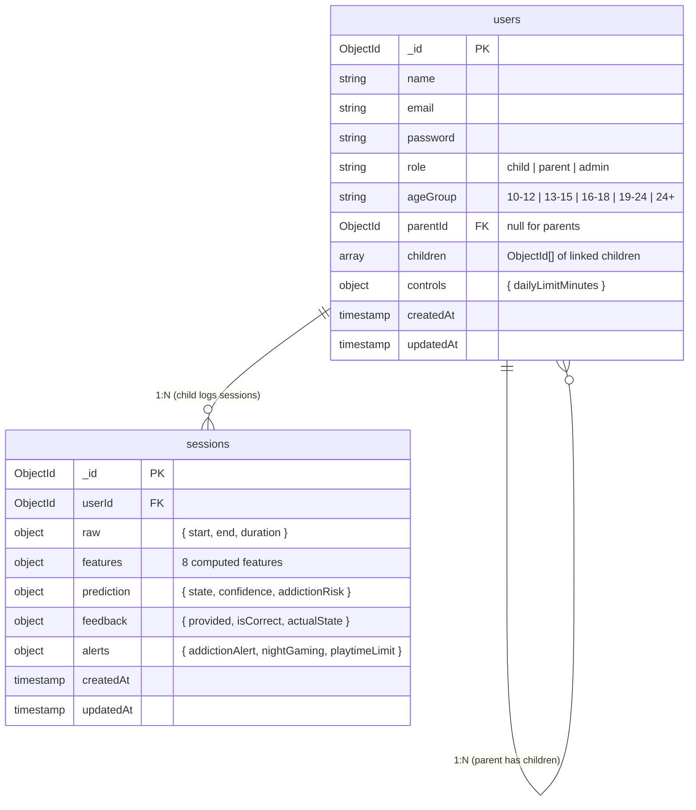

<p align="center">
  
</p>

<h1 align="center">Behavior Prediction — Gaming Behavior Analysis + ML Prediction</h1>

<p align="center">
  <strong>Track gaming sessions, predict behavioral states (Normal / Frustrated / Addicted) using ML, and alert parents in real-time via WebSocket + Email.</strong>
</p>

<p align="center">
  
  
  
  
  
</p>

---

## Table of Contents

1. [Problem Statement](#problem-statement)
2. [Our Solution](#our-solution)
3. [System Architecture](#system-architecture)
4. [ML Pipeline](#ml-pipeline)
5. [Tech Stack](#tech-stack)
6. [Project Structure](#project-structure)
7. [Database Schema](#database-schema)
8. [Features](#features)
9. [API Reference](#api-reference)
10. [Getting Started](#getting-started)
11. [Environment Variables](#environment-variables)

---

## Problem Statement

Monitoring children's gaming behavior is challenging when:

- **Invisible patterns** — Parents can't see when, how long, or how frequently their child plays
- **Gaming addiction is gradual** — By the time it's visible, the pattern is deeply ingrained
- **Night gaming goes undetected** — Sessions between 12 AM – 4 AM often slip past parental awareness
- **Manual tracking fails** — Asking children to self-report is unreliable
- **No actionable alerts** — Even if a parent suspects excessive gaming, there's no data-driven way to confirm it

> **Result:** Parents are left in the dark, and behavioral issues escalate before they can intervene.

---

## Our Solution

**Behavior Prediction** automates the entire monitoring flow — from session logging to real-time alerts:

| Step | What Happens |
|------|-------------|
| **Log** | The child's gaming session (start, end, duration) is logged via the app |
| **Compute** | 8 behavioral features are computed in real-time (avg session duration, short session ratio, reopen count, inter-session gap, daily total time, sessions per day, night count, trend) |
| **Predict** | Features are sent to a Random Forest ML model that classifies the state as **Normal**, **Frustrated**, or **Addicted** with a confidence score and addiction risk (0–100) |
| **Alert** | If risk is high, parents are notified instantly via **WebSocket** (live dashboard) + **Email** (Gmail SMTP) |
| **Feedback** | Users can provide feedback on predictions to improve model accuracy |
| **Retrain** | Admin can trigger model retraining using all collected feedback data |

---

## System Architecture

```
┌─────────────────────────────────────────────────────────────────────────┐
│                           Frontend (React + Vite)                      │
│  ┌──────────┐  ┌──────────────┐  ┌────────────┐  ┌──────────────────┐ │
│  │  Login   │  │   Parent     │  │  Children  │  │  Child           │ │
│  │  Page    │  │  Dashboard   │  │  Page      │  │  Dashboard       │ │
│  └──────────┘  └──────────────┘  └────────────┘  └──────────────────┘ │
│       │               │                │                │             │
│       └───────────────┼────────────────┼────────────────┘             │
│                       │           WebSocket                           │
└───────────────────────┼───────────────────────────────────────────────┘
                        │ HTTP + WS
┌───────────────────────▼───────────────────────────────────────────────┐
│                     Backend (Node.js + Express + TypeScript)          │
│  ┌────────────┐  ┌──────────────┐  ┌──────────────┐  ┌───────────┐  │
│  │  Auth      │  │  Session     │  │  Feature     │  │ Notifier  │  │
│  │  Service   │  │  Service     │  │  Engine      │  │ WS+Email  │  │
│  └────────────┘  └──────┬───────┘  └──────────────┘  └───────────┘  │
│                         │                                            │
│                    MongoDB                                           │
└─────────────────────────┼────────────────────────────────────────────┘
                          │ HTTP
┌─────────────────────────▼────────────────────────────────────────────┐
│                      ML Service (Python + FastAPI)                    │
│  ┌──────────┐  ┌──────────────┐  ┌──────────────┐                   │
│  │ /predict │  │  /retrain    │  │  /health     │                   │
│  │ RF Model │  │  Hot-swap    │  │  Model info  │                   │
│  └──────────┘  └──────────────┘  └──────────────┘                   │
└──────────────────────────────────────────────────────────────────────┘
```

---

## ML Pipeline

### 8 Behavioral Features

Each gaming session triggers real-time feature computation:

| # | Feature | Description |
|---|---------|-------------|
| 1 | `avgSessionDuration` | Average session length today (minutes) |
| 2 | `shortSessionRatio` | Fraction of sessions under 5 minutes (rage-quits) |
| 3 | `reopenCount` | Sessions with < 2 min gap (compulsive reopening) |
| 4 | `interSessionGap` | Average gap between sessions today (minutes) |
| 5 | `dailyTotalTime` | Total play time today (minutes) |
| 6 | `sessionsPerDay` | Number of sessions today |
| 7 | `nightCount` | Sessions started between 12 AM – 4 AM |
| 8 | `trend` | Today's total − oldest day's total (rising = escalation) |

### 2 Engineered Features (added during training)

| Feature | Formula |
|---------|---------|
| `intensityScore` | `avgSessionDuration × 0.4 + trend × 0.3 + dailyTotalTime × 0.2 + nightCount × 10 × 0.1` |
| `frustrationScore` | Composite of short session ratio, reopen frequency, session gap, and duration — normalized by intensity |

### Model: Random Forest Classifier

| Parameter | Value |
|-----------|-------|
| Algorithm | Random Forest |
| Estimators | 200 |
| Max Depth | 4 |
| Min Samples Leaf | 10 |
| Class Weight | Balanced (auto) |
| Training Data | Standard dataset (2400 balanced samples: 800/class) + real user feedback |

### Model Performance

| Metric | Score | Target |
|--------|-------|--------|
| Test Accuracy | **71.93%** | 70% – 75% |
| Balanced Accuracy | **71.94%** | ≥ 70% |
| F1 Macro | **72.19%** | ≥ 70% |
| Overfitting Gap | **6.21%** ✅ | < 8.00% |
| 5-Fold CV (f1_macro) | **75.31% ± 1.97%** | — |

> **Note:** The model uses a standard dataset (`dataset.csv`) generated with overlapping Gaussian distributions to model realistic variance in human behavior (target accuracy: **70%–75%**). As real user feedback is collected via the app, the model is retrained and adapts to real-world data.

### Prediction Pipeline Flow

```
  Gaming Session Ends
         │
         ▼
  ┌────────────────────────┐
  │  Feature Engine        │
  │  8 features computed   │
  │  from today + week     │
  └───────────┬────────────┘
              ▼
  ┌────────────────────────┐
  │  ML Service (/predict) │
  │  +2 engineered features│
  │  Random Forest → state │
  └───────────┬────────────┘
              ▼
  ┌────────────────────────┐
  │  Alert Engine          │
  │  Addiction alert?      │
  │  Night gaming alert?   │
  │  Playtime exceeded?    │
  └───────────┬────────────┘
              ▼
  ┌────────────────────────┐
  │  Notification Service  │
  │  WebSocket (instant)   │
  │  Email (reliable)      │
  └────────────────────────┘
```

### Feedback-Driven Retraining & Labeling System

```
  Users / Admins submit ground-truth corrections (actualState)
               │
  Admin triggers POST /api/predictions/retrain
               │
  Backend queries ALL feedback from MongoDB & sends to ML Service (POST /retrain)
               │
  ML Service writes feedback_data.csv → runs train.py → hot-swaps model.pkl in memory
               │
  New predictions immediately use the improved model (zero downtime)
```

#### 1. Feedback Schema vs. Internal Training Schema
- **`actualState` → `label`:** When submitting feedback through the app, users provide the **`actualState`** (`Normal`, `Frustrated`, or `Addicted`). When `train.py` loads `feedback_data.csv`, it standardizes `actualState` into the target **`label`** column for scikit-learn.
- **`sessionId` Deduplication:** Feedback rows include `sessionId` so `train.py` can automatically deduplicate multiple submissions for the same session (keeping the latest feedback).
- **`source` & `weight` Metadata:** `train.py` automatically injects `source` (`"synthetic"` vs. `"feedback"`) and `weight` (`1.0` vs. `5.0`) into `trained_data.csv` during preprocessing.

#### 2. Data Blending & 5× Sample Weighting
- **Blended Training (< 800 feedback samples):** If fewer than 800 real feedback rows exist, `train.py` blends the standard synthetic dataset (`dataset.csv`, 2,400 rows) with the feedback rows.
- **5× Sample Weighting (`FEEDBACK_WEIGHT = 5.0`):**
  - Standard dataset samples receive a sample weight of `1.0`.
  - Real human feedback samples receive a sample weight of `5.0`.
  - This ensures that **one real human feedback row has 5× more influence** on the Random Forest decision boundaries than a synthetic row.
- **Feedback-Only Transition (≥ 800 feedback samples):** Once 800+ real feedback samples are collected across at least 2 classes, `train.py` automatically drops synthetic data and trains **100% on real user feedback**.

---

## Tech Stack

### Backend

| Technology | Purpose |
|------------|---------|
| **Node.js 20** | Runtime |
| **Express 5** | REST API framework |
| **TypeScript** | Type-safe codebase |
| **MongoDB + Mongoose** | Document database for users and sessions |
| **WebSocket (ws)** | Real-time parent alerts |
| **Nodemailer** | Email alerts via Gmail SMTP |
| **jsonwebtoken** | JWT-based authentication |
| **bcryptjs** | Password hashing |
| **Zod** | Request validation |
| **Pino** | Structured logging |
| **Helmet** | Security headers |

### Frontend

| Technology | Purpose |
|------------|---------|
| **React 18** | UI framework |
| **Vite** | Build tool and dev server |
| **TanStack React Query** | Server state management |
| **React Router v6** | Client-side routing |
| **Recharts** | Data visualization and charts |
| **Framer Motion** | Animations |
| **Tailwind CSS** | Utility-first styling |
| **Axios** | HTTP client |

### ML Service

| Technology | Purpose |
|------------|---------|
| **Python 3.11** | Runtime |
| **FastAPI** | ML API server |
| **scikit-learn** | Random Forest classifier |
| **pandas / NumPy** | Data processing |
| **matplotlib** | Confusion matrix visualization |

---

## Project Structure

```
Behavior-Prediction/
├── README.md
│
├── Backend/
│   ├── Dockerfile                  # Render / AWS deployment
│   ├── src/
│   │   ├── config/                 # Database, env, JWT, mail, websocket config
│   │   ├── controllers/            # Route handlers (auth, session, prediction, parent)
│   │   ├── dto/                    # Data transfer objects
│   │   ├── errors/                 # Custom error classes
│   │   ├── interfaces/             # TypeScript interfaces (User, Session, Prediction)
│   │   ├── middleware/             # Auth guard (protect, requireParent, requireAdmin)
│   │   ├── models/                 # Mongoose schemas (User, Session)
│   │   ├── repositories/          # Data access layer (UserRepo, SessionRepo)
│   │   ├── routes/                 # API route definitions
│   │   ├── services/              # Business logic
│   │   │   ├── AuthService.ts      # Registration, login, JWT
│   │   │   ├── SessionService.ts   # Session logging, feedback
│   │   │   ├── FeatureEngine.ts    # 8-feature computation (pure functions)
│   │   │   ├── PredictionClient.ts # HTTP client to ML service
│   │   │   ├── RetrainService.ts   # Feedback export + retrain trigger
│   │   │   ├── NotificationService.ts # WebSocket + Email alerts
│   │   │   └── ParentService.ts    # Parent dashboard, child linking
│   │   ├── validators/            # Zod request schemas
│   │   ├── websocket/             # WebSocket gateway
│   │   ├── app.ts                 # Express app setup
│   │   └── server.ts             # Entry point
│   └── package.json
│
├── Frontend/
│   ├── src/
│   │   ├── components/            # Reusable UI (Sidebar, AlertToast, StateBadge)
│   │   ├── context/               # AuthContext (session management)
│   │   ├── hooks/                 # useWebSocket (real-time alerts)
│   │   ├── pages/                 # App pages
│   │   │   ├── LoginPage.jsx       # Auth (login + register)
│   │   │   ├── DashboardPage.jsx   # Parent overview dashboard
│   │   │   ├── ChildrenPage.jsx    # Parent → manage children
│   │   │   ├── AlertsPage.jsx      # Parent → view alerts
│   │   │   ├── ChildDashboardPage.jsx # Child → personal stats
│   │   │   ├── HistoryPage.jsx     # Child → session history + feedback
│   │   │   └── Layout.jsx         # Shared layout with sidebar
│   │   ├── utils/                 # API client (Axios)
│   │   ├── App.jsx                # Root component + routing
│   │   └── main.jsx               # Vite entry point
│   └── package.json
│
└── ML/
    ├── Dockerfile                  # Render / AWS deployment
    ├── main.py                     # FastAPI server (/predict, /retrain, /health)
    ├── train.py                    # Model training (synthetic + feedback data)
    ├── requirements.txt            # Python dependencies
    ├── model.pkl                   # Trained model (generated)
    ├── trained_data.csv            # Training dataset (generated)
    └── confusion_matrix.png        # Model evaluation plot (generated)
```

---

## Database Schema



---

## Features

### Authentication
- **Email + Password Registration** — Secure account creation with bcrypt hashing
- **Role-based Access** — Three roles: `child`, `parent`, `admin`
- **JWT Authentication** — Token-based session management
- **Route Guards** — Role-specific middleware (`protect`, `requireParent`, `requireAdmin`)

### Session Tracking
- **Session Logging** — Log gaming sessions with start time, end time, and duration
- **Real-time Feature Computation** — 8 behavioral features computed on every session
- **ML Prediction** — Instant classification into Normal / Frustrated / Addicted
- **Addiction Risk Score** — 0–100 risk score derived from model probabilities

### Parent Monitoring
- **Parent Dashboard** — Overview of all linked children's activity
- **Child Linking** — Connect parent and child accounts via parent code
- **Parental Controls** — Set daily playtime limits per child
- **Real-time WebSocket Alerts** — Instant notifications on parent dashboard
- **Email Alerts** — Gmail SMTP notifications for addiction, night gaming, and playtime limit exceeded

### Child Experience
- **Personal Dashboard** — View own gaming stats and predictions
- **Session History** — Browse past sessions with prediction details
- **Feedback System** — Mark predictions as correct or provide the actual state

### Admin Panel
- **Feedback Stats** — View aggregated feedback counts across all users
- **Model Retraining** — Trigger ML model retraining with all collected feedback
- **Retrain Status** — Monitor model health, accuracy metrics, and last trained timestamp

### Alert System

| Alert Type | Trigger | Notification |
|------------|---------|-------------|
| **Addiction Alert** | Risk > 70% or state = Addicted | WebSocket + Email |
| **Night Gaming** | Session started 12 AM – 4 AM | WebSocket + Email |
| **Playtime Exceeded** | Daily total > parent's limit | WebSocket + Email |

---

## API Reference

### Authentication

| Method | Endpoint | Auth | Description |
|--------|----------|------|-------------|
| `POST` | `/api/auth/register` | Public | Create a new account (child / parent / admin) |
| `POST` | `/api/auth/login` | Public | Login and receive JWT token |

### Sessions (Child)

| Method | Endpoint | Auth | Description |
|--------|----------|------|-------------|
| `POST` | `/api/sessions/log` | JWT | Log a gaming session → computes features → ML prediction → alerts |
| `GET` | `/api/sessions/my` | JWT | Get own session history (last 50) |
| `POST` | `/api/sessions/:sessionId/feedback` | JWT | Submit feedback on a prediction |

### Parent

| Method | Endpoint | Auth | Description |
|--------|----------|------|-------------|
| `GET` | `/api/parent/dashboard` | JWT (Parent) | Get overview of all linked children |
| `GET` | `/api/parent/children/:childId/sessions` | JWT (Parent) | Get a specific child's sessions |
| `POST` | `/api/parent/link` | JWT (Parent) | Link a child account |
| `PUT` | `/api/parent/children/:childId/controls` | JWT (Parent) | Update parental controls |
| `GET` | `/api/parent/children/:childId/weekly-playtime` | JWT (Parent) | Get child's weekly playtime chart data |

### ML & Admin

| Method | Endpoint | Auth | Description |
|--------|----------|------|-------------|
| `GET` | `/api/predictions/health` | Public | ML service health check |
| `POST` | `/api/predictions/predict` | JWT | Direct ML prediction (used internally) |
| `POST` | `/api/predictions/retrain` | JWT (Admin) | Trigger model retraining with all feedback |
| `GET` | `/api/predictions/retrain/status` | JWT (Admin) | Current model metadata and metrics |
| `GET` | `/api/predictions/feedback-stats` | JWT (Admin) | Feedback counts by state and user |

---

## Getting Started

### Prerequisites

- **Node.js** 20+
- **Python** 3.11+
- **MongoDB** (local or [MongoDB Atlas](https://www.mongodb.com/atlas))
- Gmail account with [App Password](https://myaccount.google.com/apppasswords) (for email alerts)

### 1. Clone the Repository

```bash
git clone https://github.com/BhuvanSShetty/Behavior-Prediction.git
cd Behavior-Prediction
```

### 2. Backend Setup

```bash
cd Backend
npm install
```

Create `Backend/.env`:

```env
PORT=5050
NODE_ENV=development
MONGO_URI=your_mongodb_connection_string
JWT_SECRET=your_jwt_secret
JWT_EXPIRES_IN=7d
ML_SERVICE_URL=http://localhost:8000
GMAIL_USER=your_gmail@gmail.com
GMAIL_PASS=your_gmail_app_password
```

```bash
npm run build
npm run start
```

### 3. ML Service Setup

```bash
cd ML
pip install -r requirements.txt
python train.py          # Train the model (generates model.pkl)
uvicorn main:app --port 8000
```

### 4. Frontend Setup

```bash
cd Frontend
npm install
```

Create `Frontend/.env`:

```env
VITE_API_URL=http://localhost:5050
```

```bash
npm run dev
```

### 5. Open the App

Visit **http://localhost:5173** in your browser.

---

## Environment Variables

### Backend (.env)

| Variable | Default | Description |
|----------|---------|-------------|
| `PORT` | `5050` | Backend server port |
| `NODE_ENV` | `development` | Environment (development / production) |
| `MONGO_URI` | — | MongoDB connection string |
| `JWT_SECRET` | — | Secret key for JWT signing |
| `JWT_EXPIRES_IN` | `7d` | JWT token expiry |
| `ML_SERVICE_URL` | `http://localhost:8000` | ML microservice URL |
| `GMAIL_USER` | — | Gmail address for email alerts |
| `GMAIL_PASS` | — | Gmail app password (not login password) |

### Frontend (.env)

| Variable | Default | Description |
|----------|---------|-------------|
| `VITE_API_URL` | `http://localhost:5050` | Backend API base URL |

### ML Service (Environment)

| Variable | Default | Description |
|----------|---------|-------------|
| `MODEL_PATH` | `model.pkl` | Path to trained model file |
| `FEEDBACK_PATH` | `feedback_data.csv` | Path to feedback CSV |
| `TRAIN_DATA_PATH` | `trained_data.csv` | Path to training data output |
| `FEEDBACK_WEIGHT` | `5.0` | Weight multiplier for feedback samples |
| `TUNE` | `0` | Set to `1` to run GridSearchCV |
| `SMOTE` | `0` | Set to `1` to enable SMOTE oversampling |

---

## Deployment

Both Backend and ML services include Dockerfiles for Render / AWS deployment:

```bash
# ML Service
cd ML
docker build -t behavior-ml .
docker run -p 8000:8000 behavior-ml

# Backend
cd Backend
docker build -t behavior-backend .
docker run -p 5050:5050 --env-file .env behavior-backend
```

> **Note:** The ML Dockerfile pre-trains the model at build time so the container starts ready. Retraining via the `/retrain` endpoint updates the model in the running container.

---

<p align="center">
  Built by <a href="https://github.com/BhuvanSShetty">Bhuvan S Shetty</a> &amp; <a href="https://github.com/Abhishekrana30">Abhishek Rana</a>
</p>
